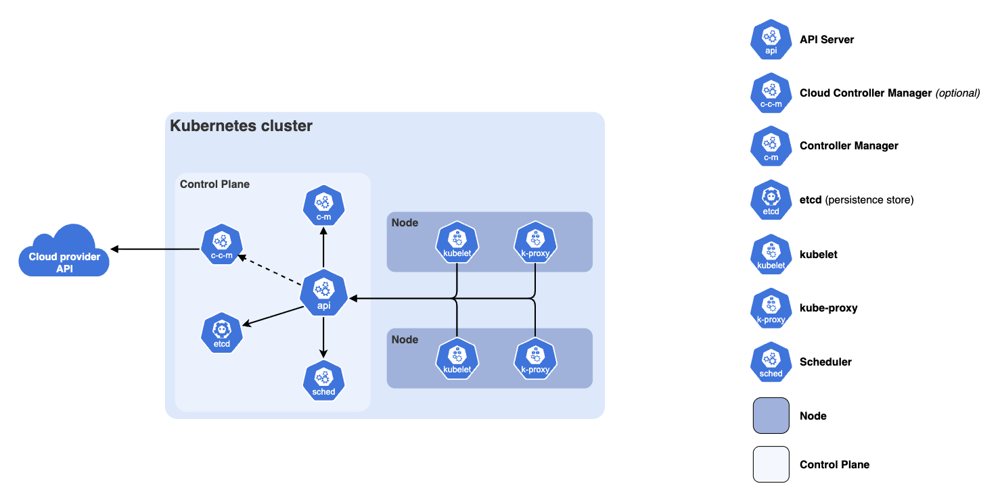

## 📆 2025-12-01

### 🔔 스크럼

- Kubernetes 기초 강의 복습 및 정리
- 헤더 프로필 이미지 처리

### 🚀 Today I Learned

#### **Kubernetes**

- 컨테이너 → 배포쉬움/운영쉬움 = 많이 만들기 쉬움 → 관리하기 힘듬 → 이를 위해 등장
- 컨테이터 오테스트레이션 시스템 : 여러개의 컨테이너화된 애플리케이션을 어디서나 배포, 확장, 관리할 수 있는 오픈소스 시스템
  - 애플리케이션 상태를 지속적으로 모니터링
  - 문제 발생시 자동으로 제외, 재시작, 제거 가능함 ← 애플리케이션 안정성 높임
- 특징
  - 자가치유
  - 자동 롤백
  - 무중단 배포
  - 수평 스케일링 : 부하에 따라 컨테이너 추가/제거하여 유연하게 트래픽 받음
    - 클러스터에서 실행되는 파드의 수를 늘리는것
- 단점
  - 매우 복잡하다
  - 비용 문제
- 클러스터 내에서 요소들이 자동으로 발견되고, 통신할 수 있도록 서비스 디스커버리, 로드밸런싱 하는것
  - 서비스 디스커버리?
    - 클러스터 ← Pod(하나 이상의 컨테이너가 실행되는 최소 배포 단위)를 자동으로 찾고 연결
- 구성요소
  
  - 클러스터
    - 하나 이상의 마스터 노드, 여러 워크노드로 이뤄져있는 구성
  - 마스터 노드
    - 전체 클러스터를 관리하는 노드
    - 관리 구성요소를 Control Plane이라고 부름
      - 중앙 제어 역할
      - 클러스터의 상태를 결정, 기억, 워커노드 조정하는 역할
      - “무엇을 실행할지”, “어떻게 원하는 상태를 유지할지” 결정
    - 주요 구성 요소
      - **API server** : 클러스터 내부에서 상호작용 하는 “인터페이스”
      - **scheduler** : 클러스터가 원하는 요청에 따라 Pod를 적정한 워커 노드에 배치하는 역할
      - controller-manager : 클러스터 조정할 때 “원하는 상태” 를 선언 해놓는데, 그 상태 유지하려면 컨트롤을 해야하는데그걸 실행하는 역할
      - etcd : 모든 데이터를 저장하는 키-값 저장소
      - cloud-controller-manager(CCM) : 클라우드 플랫폼을 제어하는 요소
  - 워커 노드
    - 실제로 컨테이너 애플리케이션 실행되는 노드
    - 주요 구성
      - kubelet: 워커노드에 1개씩 존재, 마스터 노드랑 통신함. 내 워커 노드 상태(자원 사용량, 할당량, 파드 상태, 컨테이너 상태 등) 보고, 관리
        - 누구한테? 마스터노드 안에있는 apiserver한테
      - kube-proxy : 네트워킹 관리. 각 노드에 어떤 파드가 있어? 를 알아채서 전달하는 역할(서비스 디스커버리 & 로드밸런싱 지원)
      - container runtime
        - 컨테이터 실행하는 소프트웨어
        - docker, containerd 실행 런타임
        - 파드의 애플리케이션 워크로드가 실행되는 환경을 제공함
        - 예전에는 도커를 썼지만, 요즘은 containerd같은 더 가벼운 런타임 많이 사용
        - 큐블릿이 시키는 대로 이미지를 가져와서 띄우는 역할
      - kubectl ← 큐브 컨트롤
        - 마스터 노드 안에 있는게 아니라. 우리가 쓰는 리모컨
        - 쿠버네티스 API서버랑 대화할때 사용하는 명령줄 도구
  - Pod
    - 쿠버네티스에서 가장 작은 배포 단위
    - 하나 이상의 컨테이너를 포함
    - 죽었다 살아났다함 → IP값 계속 달라짐 → 그래서 Pod를 IP로 구분하기 어려움 → 얘를 집합화한게 서비스
  - 서비스
    - Pod의 집합을 추상화
    - 네트워크 서비스를 제공하는 논리적인 집합체
    - 로드밸런싱, 서비스 디스커버리 지원
  - 디플로이먼트
    - 애플리케이션, 배포, 업데이트 관리 객체
    - 상태를 정의하고 이를 유지하도록 함
    - 롤링 업데이트, 롤백 지원함
  - 사용이유
    - 많은 컨테이너들은 안정적으로 관리, 확장 간편하게 관리를 자동화 → 운영복잡성 낮춤
  ### 실무에서 주요 용도
  1. 마이크로 아키텍처 서비스일때
     1. MSA 각 서비스들을 관리/배포할때 사용
  2. 무중단 서비스 + 자동복구 해야할때
  3. 클리우드 벤더 종속성 회피할 수 있음
     1. AWS → Azure로 옮길 수 있음
     2. 쿠버네티스로 구현하면 구조 그대로 그냥 바로 다른 클라우드(or 온프레미스 서버) 갈 수 있음

#### Master Node / Worker Node

- Master Node : 클러스터 제어, 관리하는 중앙 제어장치
  - 상태 기록, 관리
  - 작업 스케줄링, 자원 할당, 노드간 조율, 통신도 다당
  - 자가 치유 메커니즘 → 장애 발생시 자동으로 복구
- Worker Node : 애플리케이션이 실행되는 파드들을 호스팅하는 서버
  - 클러스터에서 실제 작업 역할
  - 마스터 노드 지시에 따라 파드들을 생성하거나 지우거나
  - 사용자 요청을 처리하고 작업을 분산한다
- 마스터 노드랑 워커노드 상호작용과정
  1. 작업 계획 및 배치
     1. 마스터노드는 클러스터 상태 사용 정보, 파드 배치를 계획
     2. 스케줄러 ← 파드를 적저한 워커노드 할당
  2. 작업 명령 전달 실행
     1. 마스터노드 → 워커노드 A야 너가 파드 하나 더 만들어라
     2. 워커노트는 파드를 실행
     3. 컨테이너 런타임으로 돌리고
  3. 상태 동기화 복구
     1. 워커노드 실행 중인 파드 ← 상태, 리소스 사용 → 마스터 노드에 보고(API Server에)
     2. 마스터 노드는 보고받은 정보로 클러스터 상태를 업데이트
     3. 문제 생기면, 작업 재조정, 복구
  4. 네트워크 통신, 트래픽 처리
     1. 워커 노드의 kube-proxy ← 네트워크 트래픽 라우팅
     2. 서비스, 파드 간의 통신 처리
     3. 마스터 노드에서는 이런 통신 정책 설정
- 사용이유
  - 마스터 노드 : 중앙에서 집중적으로 제어, 관리, 조율하기 위해, 안정적으로 분산, 효율적
  - 워커 노드 : 사용자 요청 처리, 작업을 분산 → 클러스터 확장성 + 안정성 보장
- 워커노드에 파드를 배치하는 방법
  - **특정 노드에 특정 파드가 있다는걸 보장하지 않음**
  - ex) 노드 A ← BE, 노드 B ← FE등
  - 마스터노드가 실시간으로 판단함
  - 백엔드 요청이 많아졌다
    - 노드 A만 백엔드 파드를 가지고 있음
    - 스케줄러 ← 노드 어디다가 파드 추가하는게 유리하지?
      - 판단 기준 : 가용성, 리소스 여유
    - 판단 끝에 백엔드 파드를 A,B에 1개씩 줬음
    - 그럼 A → BE,FE. B → BE
    - 이후에 트래픽이 떨어지면
      - A → FE
      - B → BE
      - 초반이랑 달라짐! → 따라서, 특정노드에 특정파드가 있다는걸 보장하지않음.
      - 파드는 동적으로 생겼다 없어졌다 함

#### Pod

- 하나 이상의 컨테이너를 그룹화하여 실행 환경과 네트워크 자원, 스토리지를 공유하는 가장 작은 배포 단위
- ex) Pod 하나에 백엔드 컨테이너 + 로그 컨테이너 + 네트워크/볼륨 공유할거야 → 이게 최소 배포단위
- Pod1(단일 컨테이너) ← 거의 이거씀
  - pod는 생성, 삭제가 상당히 자유롭다.
  - pod는 영구적인 개체가 아니기에 뭔가를 저장한다는거 자체가 좋은 케이스가 아님
- Pod2(컨테이너 + 볼륨(환경파일, secret파일)) ← pod가 기억해야할때 사용
- Pod3(여러 컨테이너)
  - 사이트카 패턴 : 메인 컨테이너 + 보조 컨테이너가 구성되는 경우
  - 각 컨테이너가 서로 의존성 높을때
  - 실무 : 로그 수집기, 프록시
- Pod4
  - 복잡한 구성
  - 어댑터 구성 : 여러 컨테이너가 하나의 파드 안에서 공통의 작업물을 공유하고, 협업할때
- Q : 파드가 어짜피 배포 단위면 “FE + BE + DB + 세션”을 하나의 파드에 넣으면 안됨?
  - A : 안됨, 안티패턴임
    - 스케일링 문제
      - FE에만 접속 몰리면, FE만 처리해줄수 없고, 저 세트를 늘려야함
    - 배포 문제
      - 파드를 고치면 삭제하고 새롭게 만든다
- 사용하는 이유 : 애플리케이션의 각 구성 요소(컨테이너)를 논리적으로 묶어 단일 단위로 관리하고 배포할 수 있게 하여, 동일한 네트워크 및 스토리지 환경에서 함께 실행되도록 하기 위해서

#### Label

- 오브젝트에 부착되는 키-값 쌍으로, 오브젝트를 식별하고 그룹화하는데 사용함
  - 왜?
    - 파드는 계속 생성, 삭제되므로, 라벨의 조합으로 특정 오브젝트들을 그룹화하고, 이 그룹을 선택하기 위함
- ex) `env=production`, `app=backend`
- 주요용도 : 오브젝트 식별 및 그룹화, 리소스 역할 표시, 버전관리

#### Selector

- 특정 라벨을 가진 오브젝트를 선택하고 필터링하는 데 사용되는 매커니즘
- Label을 리소스에 **`부착`**하고, Selector를 사용해 필요한 리소스를 **`선택`**해 실행하는 구조
- 일반적으로 AND 조건

#### Service

- 파드 집합에 대한 네트워크 엔드포인트를 생성하고, 클러스터 내부/외부에서 해당 파드들에 안정적 접근할 수 있도록 하는 리소스
- 3가지 핵심 기능
  - 안정적인 주소 : 파드 IP가 바뀌어도 변경되지 않는 서비스 IP
  - 로드밸런싱 : 파드가 3개면, 트래픽을 1:1:!1로 분배함
  - 서비스 검색(Service Discovery) : 백엔드 파드 어디에 있어?라고 물어보면 DNS이름으로 위치에 알려줌
- 3가지 타입
  - ClusterIP (기본값)
    - 외부에서는 접속불가, 오직 클러스터 내부의 파드끼리만 통신 가능
    - 실무에서 제일 많이 사용
      - 노출하면 안되는 서비스들은 다 Cluster IP 형식으로 만든다
    - 사용이유 : 클러스터 내, 애플리케이션 구성 요소들이 서로 통신할때 사용함
  - Node Port
    - 워커 노드의 특정 포트를 열어서 외부 접속을 허용함
    - 사용이유 : 외부 네트워크에서 특정 노드 IP+Port 개방해서 서비스에 바로 접근하게
    - 사용 사례 : 개발 환경, 간단한 서비스
      - 메인 서비스용으로는 잘 안씀 ← 이미 ALB형식 인그레스를 쓰고, 포트가 외부에 직접 노출되기 때문에(운영환경에서는 보안이슈때문에)
      - 필요한 경우가 있음
        - 온프레미스 환경
          - 회사 전산실, 물리 서버가 있어서 직접 쿠버네티스 설치할때
        - 내부 관리자용 도구
          - Jenkins, Promethues, Grafana, Portainer, Registry
  - LoadBalancer
    - AWS같은 클라우드 환경에서 진짜 로드밸런서(ELB)를 앞에 붙여주는 방식
    - 자주 사용하는 방식은 아님(비용문제 있음)

### 🔥 오늘의 도전 과제와 해결 방법

- 헤더의 프로필 이미지를 어디에 저장하고 어떻게 효율적으로 렌더링할까?
  - 결론 : localStorage에 저장해 프론트에서 직접 렌더링함
  - 이유
    - 페이지 로딩마다 API를 호출하면 비효율 → DB 조회량 증가
    - 프로필 URL을 쿠키에 넣어 전송하는 것은 비효율 + 보안 위험(쿠키는 매 요청마다 서버에 자동 전송됨 → 쓸데없이 요청 크기 증가)
    - 프로필은 “개인 UI 상태 데이터”라서 서버 저장소에서 관리할 이유가 없음. 서버 리소스까지 사용해야 할만큼 중요한 정보가 아님
  - 구현 방법
    - 로그인 시 프로필 URL을 localStorage에 저장
    - 헤더 로딩 시 localStorage 값만 읽어서 즉시 반영
    - 회원정보 수정(프로필 변경/삭제) 시 localStorage 업데이트
    - 로그아웃 또는 refresh 만료 시 localStorage 삭제

### 🗨️ 오늘의 회고

- 쿠버네티스를 학습하면서 이론만 보면 어렵고 추상적인데, 그래도 실습을 해보면 좀더 명확하게 알게되는 것 같다. 구조가 처음에는 마스터 노드, 워커 노드, 파드, 서비스 같은 용어들이 너무 많아서 복잡하게만 보였는데, 직접 흐름을 따라가 보니 왜 이런 구조가 필요한지 조금씩 감이 잡히기 시작했다. 여전히 어렵지만, 추상 개념 → 실습 → 다시 이론의 사이클이 확실히 이해를 더 빠르게 만든다는 걸 경험했다.
