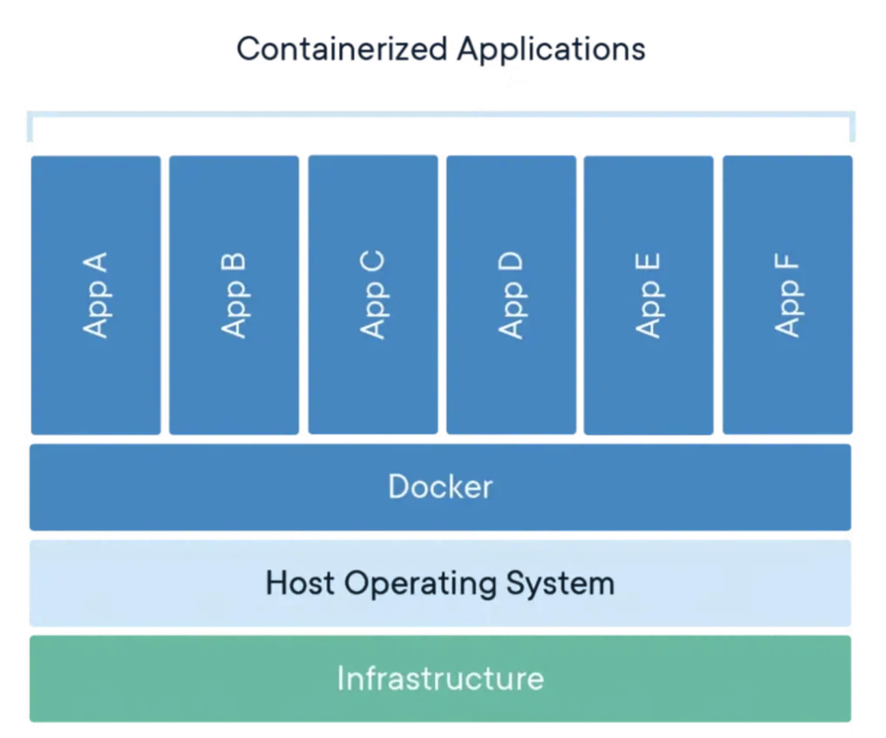

## 📆 2025-11-17

### 🔔 스크럼

- 컨테이너 기초 강의 복습 및 정리
- 컨테이너 기초 실습

### 🚀 Today I Learned

#### Docker

- 애플리케이션이 실행되는 데 필요한 모든 요소를 하나로 묶어, 어떤 컴퓨터에서든 동일하게 실행되도록 도와주는 도구
- 등장배경
  - 배포환경이 다를때 어려움을 겪음
  - 가상화 등장 → 어떤 OS든 실행환경을 독립적으로 가져가려고 하는것
  - VMware → 하나의 진짜 OS가 있을때, 가짜 os들을 만들어서 app+OS를 계속 만들어냄
  - 그랬더니 app을 돌리려고 하니 OS도 만들어야하네?
  - 공통의 OS와 통신할 수 있는 무언갈 두자! = Docker
    
  - Docker, App → 유저모드
  - OS → 커널모드
- 구성 요소
  - 독립환경 = 컨테이너
  - 도커 파일 : 실행되기 위한 모든 설정을 텍스트형식으로 작성하는 문서
  - 도커 레지스트리 : 도커 이미지를 저장하고 배포하는 중앙 저장소
  - 도커 이미지 : 도커파일을 항상 실행할 수 있는 항상 똑같은 CD역할
  - 도커 데몬 : 도커 컨테이너를 관리하는 백그라운드 프로세스
- 사용이유 : 애플리케이션을 일관되게 실행하고 배포하기 위해 환경을 표준화하고, 격리된 컨테이너를 사용해 개발.테스트,프로덕션 간의 차이를 없애기 위해서
  - 빠른 배포 및 확장
  - 이식성 : 한번 빌드하면 어디서나 실행 할 수 있음
- 장점
  - 배포하기 쉬워짐
  - 자동화가 됨
    - 환경을 고정하니, 배포가 자동화가 된다
    - MSA등장
      - 기존에는 하나의 앱에다가 모든 기능을 다넣음
      - MSA = 기능 1개마다 구조를 하나 잡는것
  - 환경이 자동화는 되는데, 복잡해지네?
    - 그래서 DevOps 등장
- 단점
  - 컨테이너 ← 하나의 격리된 실행환경
    - 컨테이너 많아지면, 관리하기 힘듬 ← 쿠버네티스 등장(도커 정의서)
  - 컨테이너를 여러개 실행할 수 있음
    - 자원이 많이 필요
    - AWS에 돈을 많이 내야하네?
  - 도커는 데이터를 보관하지 않음
    - 데이터 휘발성 높아짐
      - MYSQL 돌릴순 있지만 보통 선택하지 않음
      - 그래서 RDS쓰는것
  - 배우기 어려움
    - OS단계 → 서비스들을 격리하고싶다 → 가상화 → 컨테이너 → 도커
      - OS level에대한 지식이 있어야하니까

#### Dockerfile

- 도커 이미지를 생성하기 위한 명령어 및 설정이 담긴 텍스트기반의 스크립트 파일
- 컨테이너 이미지 빌드 과정에서 사용되는 명령어, 설정 및 환경 구성을 담고 있음
- 독립적인 레이어로 나누어 관리됨
  - 하단의 Base Image를 기반으로 위쪽 레이어가 쌓이면서, 자주 변경될수록 위쪽 레이어로 배치해 빌드과정에서 캐싱 효과를 극대화하는 구조가됨
  - 이미지 빌드 시간 단축을 위해
- 사용이유 : 컨테이너 이미지를 코드로 정의해, 수동 설정 없이도 항상 동일한 환경을 재현하고, 빌드 과정을 표준화 하기 위해
- 대표적인 명령어
  - FROM : 이미지 생성시 기반이 되는 베이스 이미지 지정
  - RUN : 패키지 설치 혹은 소프트웨어 설정 등 필요한 명령을 실행할때
  - ENV : 환경변수 설정
  - EXPOSE : 포트를 외부에 노출하도록 지정
  - CMD : 컨테이너 시작시 기본적으로 실행될 명령어
  - ENTRY POINT : 컨테이너가 시작될때 항상 실행될 명령을 지정
- OverlayFS(통합 파일 시스템)
  - 여러개의 읽기 전용 디렉토리(이미지 레이어) 위에 하나의 쓰기 가능한 디렉토리를 겹쳐서, 하나의 통합된 파일시스템처럼 보이게 만드는 리눅스 기술
  - 읽고/쓰기 레이어(Thin/upper layer)는 컨테이너 별로 생성 ← 변경사항들
  - lower layer에 있는 애들은 변경불가함 → 모든 컨테이너가 같은 환경을 본다
  - 도커파일의 명령순서가 중요해짐 → 도커 이미지 캐싱여부가 달라짐
- dockerignore도 중요 → 빌드시간 늘어남(=이미지 크기가 커진다) → 배포시간과 배포 안정성에 문제 생김

#### Image

- 애플리케이션 실행에 필요한 바이너리,설정,라이브러리들을 미리 포함한 읽기전용 스냅샷
- 컨테이너는 이 이미지 위에 얇은 읽기/쓰기 레이어(Thin R/W layer)를 추가한 실행 인스턴스이며, 컨테이너를 삭제하면 R/W레이어의 변경은 사라짐
- Docker는 **copy-on-write(COW)** 방식을 사용하여, 수정 시 원본 이미지를 직접 변경하지 않고 파일을 복사해 R/W 레이어에만 변경 사항을 반영
- 사용이유 : 애플리케이션 실행에 필요한 모든 환경을 미리 구성해 어디서든 동일하게 실행될 수 있도록 하기 위해서

#### Container

- 애플리케이션과 그 실행에 필요한 모든 종속성을 포함하여 경량화되고 독립적으로 실행되는 단위
- 기존 가상화 → 하나의 물리적 하드웨어 위에 하이퍼바이저(Hypervisor)를 설치하고, 각 가상 머신(VM)마다 독립적인 Guest OS를 운영하여 애플리케이션을 실행하는 방식
  - 각 VM은 별도의 운영체제를 가지고 있음 → 자원 소모 큼
- 도커 = 컨테이너 기반 가상화 → 별도의 Guest OS를 포함하지 않고 호스트 OS의 커널을 공유하기 때문에, 가상 머신에 비해 자원 소모가 적고 더욱 가볍고 빠르게 동작
- 도커가 컨테이너인가? NO
  - 도커는 컨테이너를 손쉽게 생성, 배포, 관리할 수 있도록 지원하는 **컨테이너 관리 도구(컨테이너 엔진)**
  - 컨테이너 관리 도구 중 한개임
- 사용이유 : 애플리케이션의 실행 환경을 표준화하여 어디서든 동일한 방식으로 동작하도록 보장함으로써, 환경 의존성 문제를 제거하고 배포의 일관성을 확보하기 위해서
- 컨테이너 관리 도구 종류
  - 둘다 Kubernetes 환경에서 주로 사용
  - **containerd :** 컨테이너의 생애주기 관리 및 이미지 관리 기능제공
  - **CRI-O :** Kubernetes 전용 컨테이너 런타임
- docker pull ~ → docker hub에서 이미지 가져오는것
- docker images → 받아진 이미지들 보임
- docker run ~ → 컨테이너 실행
- docker ps → 실행되고있나
- 보통 컨테이너 안에 들어가서 명령을 수행하거나 하지는 않음
  - 로컬에 가져와서 수정하고 다시 도커에 카피

#### Registry

- 필요판 이미지를 언제든지 다운로드하거나 업로드할 수 있도록 지원하는 컨테이너 이미지 전용 저장소
- 버전관리 기능 → 이미지의 변경 이력 추적가능
- 비공개/공개 설정 가능
- 대표적은 Registry
  - Docker hub
  - Amazone ECR
- 사용이유 : 컨테이너 이미지를 중앙에서 관리하여 배포의 일관성 유지를 위함

### 🔥 오늘의 도전 과제와 해결 방법

- Docker에서 Spring Boot 이미지 빌드 실패 - 처음에는 JAR 파일 미리 생성해서
  FROM openjdk:21-jdk-XXXX 기반의 단일 스테이지 Dockerfile을 만들었는데,
  해당 태그가 실제로 존재하지 않아 이미지 pull 단계에서 계속 실패함 → 빌드 단계(Gradle) 와 실행 단계(JRE) 를 분리한 멀티 스테이지 Dockerfile 로 전환함.
- 1단계: gradle:8.5-jdk21 이미지에서 gradle bootJar 실행하여 JAR 생성
- 2단계: eclipse-temurin:21-jre 이미지에서 실행용 JAR만 복사하여 경량화된 컨테이너 구성
- 최종적으로 Docker build → run → Docker Hub push까지 정상 작동 확인

### 🗨️ 오늘의 회고

- Docker를 실제 프로젝트에 적용(실습)해보면서 빌드 과정과 실행 환경이 어떻게 구성되는지 더 명확하게 이해할 수 있었다. 그동안 단순히 개념으로만 알고 있던 이미지, 컨테이너, 빌드 단계들이 실제로 어떻게 맞물려 동작하는지 직접 설정하고 문제를 해결해보며 체감할 수 있었던 시간이었다. 환경을 스스로 구성해보니 코드와 인프라의 흐름이 훨씬 선명하게 연결되었다.
