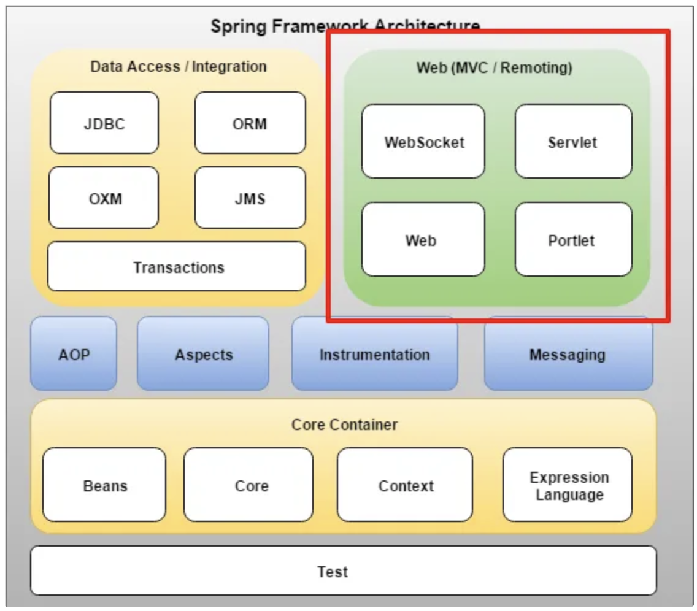
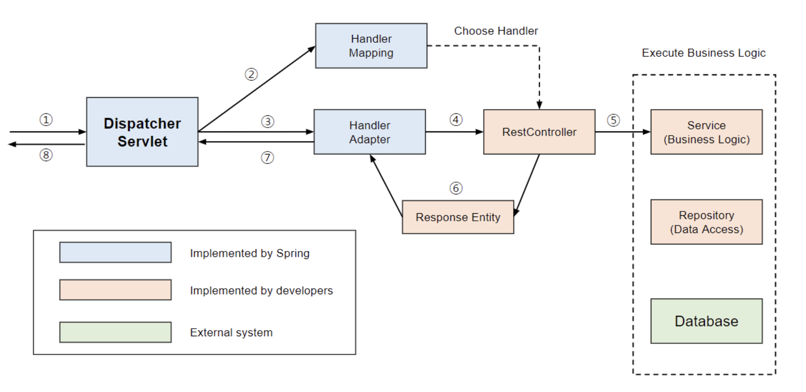

## 📆 2025-10-20

### 🔔 스크럼

- Servelt, Thymeleaf 강의 복습 및 정리
- 6주차 과제 중 타임리프 구현
  - 백엔드에 있는 html을 어떻게 프론트가 뿌려줄지
  - 푸터 생성 및 랜더링 돌리기

### 🚀 Today I Learned

<aside>
💡 서블릿, JSP, 템플릿 엔진, 타임리프는 웹 애플리케이션에서 동적인 웹 페이지를 생성하는 기술들
</aside>
 

#### 서블릿

- **자바를 사용해, 웹 페이지를 동적으로 생성하는 프로그램**
- → in java : JSP(+Servelt)
- 등장 배경 : 매번 동적으로 페이지를 만들어서 전달하는 어려움 극복을 위해 등장함. & HTTP로 전달을 하는데 이거는 통신규약이라 제약 존재. → 이를 위해 서블릿 등장
  - 과거에는 모든 서블릿을 URL 매핑을 위해 web.xml에 등록해야했지만, 이제는 서블릿이 대신해줌
- 즉, HTTP 요청, 응답 흐름을 서블릿 메서드로 제공 → 우리는 이미 이런것들을 신경쓰지않고 개발하고 있음. 서블릿 이미 사용중
- Java의 멀티쓰레딩 기능을 이용하여 동작
- 결국 서블릿도 java의 클래스기 때문에 생명주기 가짐
- 서블릿은 여러 개 만들 수 있지만, **스프링 MVC에서는 일반적으로 하나(DispatcherServlet)** 만 쓰는 구조
- **서블릿 컨테이너** : 서블릿을 담아두고 관리하는 주체(라이프 사이클 관리 등)
  - 요청이 들어오면 서블릿 컨테이너에서 어떤 서블릿이 이 요청을 처리할지 고르고 해당 서블릿한데 요청/응답 교환
  - ex ) 원래 Apache Tomcat의 용도
- **Front Controller 패턴**: MVC 구조에서 사용되는 디자인 패턴으로 서블릿 컨테이너의 맨 앞에서 서버로 들어오는 클라이언트의 모든 요청을 받아서 처리해 주는 컨뷰트롤러를 의미
  - 쉽게 설명하자면, 휴게소에서 주문할때 반복되는 작업들(주문,계산, 포장)하는 작업들을 한번에 묶어서 공통로직을 처리하는 것 → 이를 **Dispatcher Servelt이 공통작업 처리**
    
- **dispatcher Servelet** → handler mapping(요청 처리 핸들러 검색) → Handler Adaper(핸들러 호출) → user/post .. 각 처리 핸들러 → view Reslver(뷰 검색 또는 생성,html/json..) → dispatcher Servelet가 경로를 받아서 jsp파일 실행 → JSP 파일은 서버 안에서 HTML을 “동적으로 생성” (예: `${name}` 치환 등) → 완성된 HTML 결과만 클라이언트에게 응답으로 보냅니다.
  - jsp : 서블릿 기반의 동적 웹 페이지를 생성하기 위한 Java 기반 템플릿 엔진(HTML안에 자바 코드를 섞어 웹페이지를 동적으로 생성할 수 있게 해줌) - 요즘 잘사용X
  - handler mapping, Handler Adaper, view Reslver는 스프링 컨테이너에 dispatch Servelet에서 의존성 주입해서 사용함
  - 스프링 Web mvc, dispatcher servlet을 사용함으로써 개발자는 구현로직에만 집중하면됨
  - @Controller → 컴포넌트 스캔 대상 = 스프링 빈에 등록 → 디스패처 서블릿 구동될때, 핸들러 매핑에 자동으로 매핑 정보 추가
    - 쉽게) handler mapping한테 이런 요청이 오면 이 컨트롤러 쓰면돼~ 라고 알려주는것
  - 얘네는 **스프링이 만드는것임 = IoC(제어역전) = new안해도 사용할 수 있음**
- MVC패턴에서 컨트롤러로 이용됨
  - 스프링 MVC(Model-View-Controller) : 서블릿 기반의 전통적인 MVC 패턴을 지원하는 웹 프레임워크

#### 템플릿 엔진

- 지정된 템플릿 양식 + 데이터로 HTML 문서를 출력하는 소프트웨어

1. 클라이언트 사이드 템플릿 엔진(CSR)
2. 서버 사이드 템플릿엔진(SSR)

- spring web mvc 3가지
  - 정적 컨텐츠
    - 핸들러 맵퍼가 Controller를 찾지못하면 정적파일로감. 걔를 응답함
  - mvc와 템플릿 엔진
  - API

#### Thymeleaf

- 서블릿 위에서 동작하는 고급 HTML 자바 기반 템플릿 엔진
- MVC 패턴사용함
- 타임리프 엔진이 html의 th:text등 표현식을 해석하고 데이터를 집어넣어서 최종 HTML 생성
- 서버사이드 랜더링 환경 기반

### 🔥 오늘의 도전 과제와 해결 방법

- 프론트는 Express로 렌더링하고 있지만, 이용약관/개인정보처리방침처럼 정적 문서 페이지는 백엔드에서 타임리프로 렌더링해야 한다는 구조적 차이가 존재 : 이를 해결하기 위해 Spring Boot에 PageController를 추가하고 /terms, /privacy를 백엔드가 직접 HTML로 렌더링하도록 분리해서 구현

### 🗨️ 오늘의 회고

- 타임리프가 최근 트렌디한 기술은 아니지만, 스프링 기반 프로젝트와의 통합성이 높고 별도의 프론트 프레임워크 없이도 기본적인 페이지 렌더링을 안정적으로 처리할 수 있다는 장점이 크다는 걸 직접 체감했다. 특히 단순한 정적 문서 페이지라면 템플릿 엔진만으로도 구현이 충분해 개발 흐름이 훨씬 단순해지고 유지보수도 쉬워진다는 점을 느꼈다.
